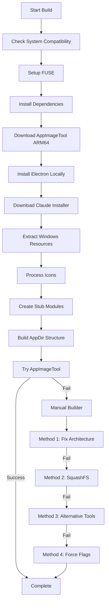

# Claude Desktop AppImage Build Guide for Fedora Asahi (ARM64)

This guide documents how to build Claude Desktop as an AppImage on Fedora Asahi Remix (ARM64/aarch64) systems.

## Overview

Claude Desktop is officially available for Windows, macOS, and some Linux distributions, but not as an AppImage for ARM64 systems like Apple Silicon Macs running Asahi Linux. This guide shows how to extract the Windows version and repackage it as a functional ARM64 AppImage.

## Prerequisites

### System Requirements
- **Fedora Asahi Remix** (tested on version 42)
- **ARM64/aarch64 architecture**
- **Sudo privileges** for installing dependencies
- **Internet connection** for downloading dependencies and Claude installer

### Required Dependencies
The build script will check for and help install these dependencies:
- `p7zip` - For extracting Windows installer
- `wget` - For downloading files
- `icoutils` (wrestool, icotool) - For extracting and converting icons
- `ImageMagick` (convert) - For image processing
- `nodejs` and `npm` - For Electron and JavaScript tools
- `squashfs-tools` - For creating the AppImage filesystem
- `fuse` and `fuse-libs` - For FUSE support (usually pre-installed)

## Build Process

### Step 1: Prepare the Build Environment

1. **Clone or download the build scripts** to your desired directory
2. **Make scripts executable**:
   ```bash
   chmod +x fedora_asahi_build_script.sh
   chmod +x manual_appimage_builder.sh
   ```

### Step 2: Run the Main Build Script

Execute the main build script:
```bash
./fedora_asahi_build_script.sh
```

The script will:
- ✅ Check system compatibility (Fedora Asahi ARM64)
- ✅ Verify and fix FUSE setup for AppImage support
- ✅ Install missing dependencies via `dnf`
- ✅ Download and install ARM64 AppImageTool
- ✅ Install Electron locally with ARM64 support
- ✅ Download Claude Desktop Windows installer
- ✅ Extract resources from the Windows installer
- ✅ Process and convert application icons
- ✅ Create stub implementations for Windows-specific modules
- ✅ Prepare the AppImage directory structure

### Step 3: Handle AppImageTool Architecture Issues

If the main script fails at the AppImage creation step (common issue with ARM64 appimagetool), run the manual builder:

```bash
./manual_appimage_builder.sh
```

This script tries multiple methods:
1. **Method 1**: Fix architecture detection by copying Electron binary
2. **Method 2**: Manual AppImage creation using SquashFS
3. **Method 3**: Alternative tools (appimage-builder)
4. **Method 4**: Force architecture flags

### Step 4: Verify the Build

Once successful, you'll have:
```
Claude_Desktop-0.9.3-aarch64.AppImage
```

Test the AppImage:
```bash
./Claude_Desktop-0.9.3-aarch64.AppImage
```

## Architecture-Specific Considerations

### Why ARM64 Builds Are Challenging

1. **Cross-platform compatibility**: Claude Desktop is primarily designed for x86_64
2. **Native modules**: Some Node.js modules need ARM64 versions
3. **Electron compatibility**: Requires ARM64-compatible Electron runtime
4. **AppImageTool limitations**: Architecture detection issues on ARM64

### Fedora Asahi Specific Fixes

1. **FUSE Setup**: Modern Fedora uses FUSE3 without traditional groups
   ```bash
   # FUSE permissions are handled via udev rules:
   echo 'KERNEL=="fuse", MODE="0666"' | sudo tee /etc/udev/rules.d/99-fuse.rules
   ```

2. **Electron Bundling**: Always bundle Electron for compatibility
   ```bash
   # Local Electron installation ensures ARM64 compatibility
   npm install --save-dev electron@latest
   ```

3. **Native Module Stubs**: Replace Windows-specific modules
   ```javascript
   // Stub implementation for claude-native module
   module.exports = {
     getWindowsVersion: () => "10.0.0",
     // ... other stub functions
   };
   ```

## Troubleshooting

### Common Issues and Solutions

#### 1. FUSE Permission Denied
```bash
# Fix FUSE permissions
sudo chmod 666 /dev/fuse
sudo modprobe fuse
```

#### 2. AppImageTool Architecture Detection Failed
```bash
# Use the manual builder
./manual_appimage_builder.sh
```

#### 3. Missing Dependencies
```bash
# Install manually if auto-detection fails
sudo dnf install p7zip wget icoutils ImageMagick nodejs npm squashfs-tools
```

#### 4. Electron Not Found
```bash
# Ensure local Electron installation
npm install --save-dev electron@latest
export PATH="$(pwd)/node_modules/.bin:$PATH"
```

#### 5. SELinux Issues (if encountered)
```bash
# Temporarily disable for build (re-enable after)
sudo setenforce 0
# ... run build ...
sudo setenforce 1
```

### Build Log Analysis

Check these locations for debugging:
- **AppRun logs**: `/tmp/claude-apprun.log`
- **Build directory**: `./build/` (if build fails)
- **NPM logs**: `~/.npm/_logs/`

## Technical Details

### Build Process Flow



### Directory Structure

```
Claude_Desktop_Build/
├── fedora_asahi_build_script.sh    # Main build script
├── manual_appimage_builder.sh      # Fallback builder
├── build/                          # Temporary build directory
│   ├── ClaudeDesktop.AppDir/       # AppImage directory structure
│   │   ├── AppRun                  # Launch script
│   │   ├── claude-desktop.desktop  # Desktop entry
│   │   ├── usr/
│   │   │   ├── bin/               # Binaries
│   │   │   ├── lib/claude-desktop/ # Application files
│   │   │   └── share/             # Icons and resources
│   │   └── .DirIcon               # AppImage icon
│   └── ...                        # Extracted resources
├── package.json                    # NPM configuration
├── node_modules/                   # Local Electron installation
└── Claude_Desktop-0.9.3-aarch64.AppImage  # Final result
```

## Advanced Configuration

### Custom Build Options

The main script supports several flags:
```bash
# Don't bundle Electron (use system version)
./fedora_asahi_build_script.sh --no-bundle-electron

# Custom Claude download URL
./fedora_asahi_build_script.sh --claude-download-url "https://custom-url/claude.exe"

# Help
./fedora_asahi_build_script.sh --help
```

### Environment Variables

```bash
# Force architecture
export ARCH=aarch64

# Custom paths
export APP_IMAGE_TOOL="/custom/path/to/appimagetool"
```

## Security Considerations

### Code Verification
- Scripts download official Claude Desktop installer from Anthropic
- ARM64 AppImageTool from official AppImage project
- Electron from official npm registry

### Permissions
- Build scripts require sudo only for:
  - Installing system dependencies
  - Installing AppImageTool to `/usr/local/bin/`
  - Setting up FUSE permissions

### Sandboxing
The resulting AppImage runs with `--no-sandbox` flag due to ARM64 Electron compatibility requirements.

## Contributing

### Improving the Build Process
1. Test on different ARM64 distributions
2. Add support for other architectures
3. Improve error handling and diagnostics
4. Update for new Claude Desktop versions

### Reporting Issues
When reporting issues, include:
- Fedora Asahi version: `cat /etc/os-release`
- Architecture: `uname -m`
- Build logs and error messages
- Hardware information (Apple Silicon model)

## Version History

- **v1.0**: Initial working build for Claude Desktop 0.9.3
- **v1.1**: Added manual AppImage builder for appimagetool issues
- **v1.2**: Improved Fedora Asahi compatibility and error handling

## License and Legal

This build process extracts and repackages the official Claude Desktop application. Users must comply with Anthropic's terms of service. The build scripts themselves are provided as-is for educational and personal use.

## Acknowledgments

- **Anthropic** for Claude Desktop
- **AppImage project** for AppImage tools and runtime
- **Asahi Linux** for ARM64 Linux on Apple Silicon
- **Fedora project** for Fedora Asahi Remix

---

*Last updated: June 2025 for Claude Desktop 0.9.3 on Fedora Asahi Remix 42*